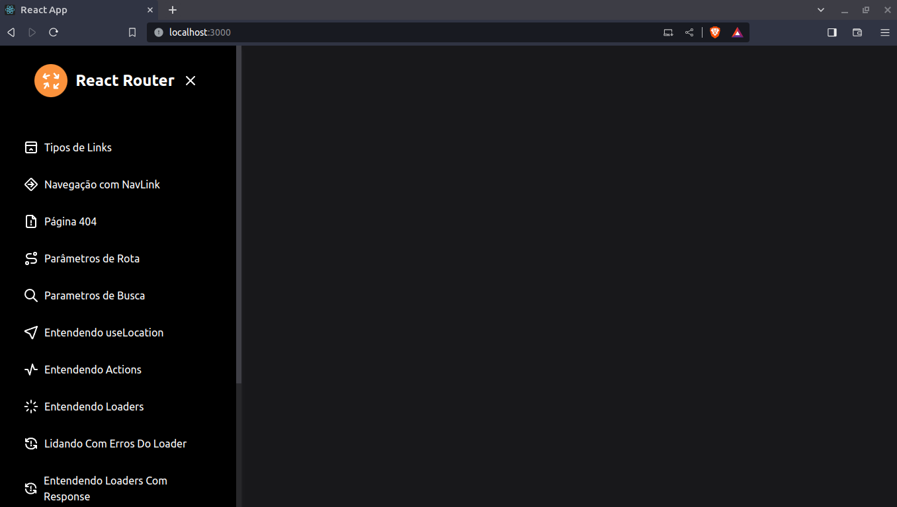
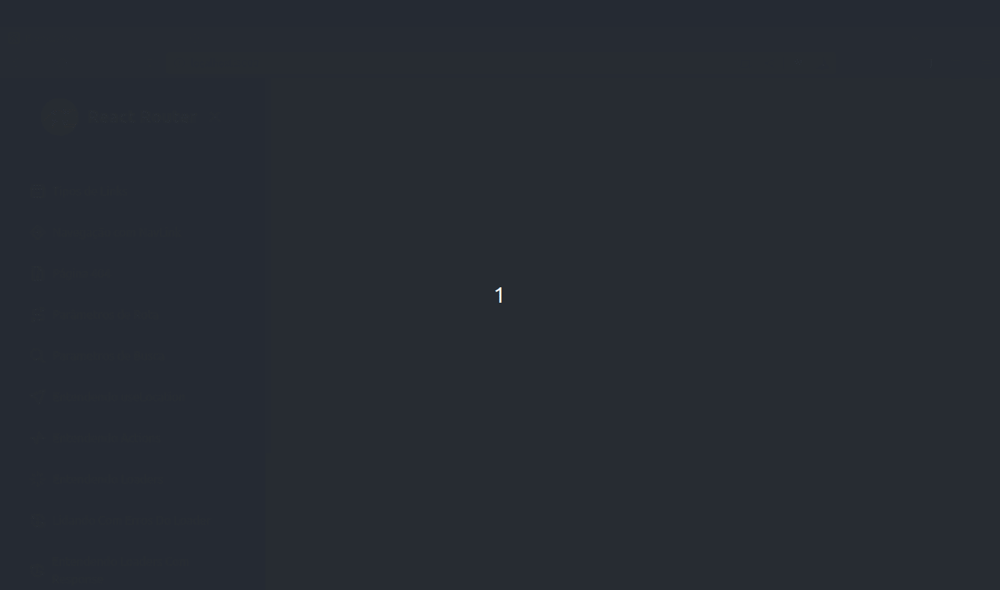

# Navegação com React.JS

</img>
</img>

## 🤔 O que é este projeto

Este projeto foi desenvolvido para aprender React Router. O React Router é uma pacote que permite que façamos diferentes navegações entre diferentes páginas na nossa aplicação React. Este projeto faz parte do Módulo Especialista, na Trilha: React & Next, do curso Navegação com React.JS da Formação DEV.

## 🖥️ Como rodar este projeto

O projeto react-router foi criado via terminal inicialmente escolha onde a pasta do projeto será criada então eu vou mova o seu terminal até lá para criar o projeto react com o comando: npx create-react-app react-router --template typescript.

Entre na pasta do projeto criado.

Instale as seguintes dependências: <code> npm i react-router dom @tabler/icons-react</code>.

Instale as dependências de desenvolvimento: <code> npm i -D autoprefixer postcss tailwind-scrollbar tailwindcss</code>.

A partir daqui você pode copiar as pastas e arquivos para dentro do projeto que foi criado.

Para rodar o projeto use o comando <code>npm start</code> dentro da pasta do projeto.

## 🕹️ Como usar este projeto

Uma vez que a aplicação esteja rodando, você pode navegar clicando no menu lateral da aplicação onde é demonstrado alguns exemplos de rotas do React Router.

## ⚙️ Tecnologias usadas no projeto

- 
- 
- 
- 
- 
- 
- 

## 🗒️ Features do projeto

<!-- caracteristicas do projeto resumidas mas não é necessaria-->

- No menu lateral do projeto demonstra com exemplos práticos como aprendemos algumas das rotas do React Router

## 🗂️ Como este projeto está organizado

<!-- dar uma ideais geral não precisa ser detalhista -->

Na pasta raiz do projeto existe uma pasta src onde todos o projeto é organizado dentre eles destacamos:

- Pasta components-> contém os componetes da aplicação.
- Pasta pages -> contém as páginas da aplicação onde vamos navegar.
- Pasta Router -> contém rotas da aplicação da aplicação.

## 👩‍💻 Como este projeto foi implementado

<!-- Aqui pode ser usado uma linguagem, mas técnica e não escrever demais-->

Este projeto foi implementado com HTML, CSS, JavaScript, TypeScript, TailwindCSS, React, React-Router.

Na pasta components especificamente criamos os componentes da aplicação.

Já pasta pages encontram-se todas as páginas da aplicação.

Pasta Router onde se encontram os caminhos que ligam uma página a outra ligando toda aplicação de forma una.

## ⭐ Dependências principais

<!-- API's importantes-->

Entre na pasta do projeto criado.

Instale as seguintes dependências: <code> npm i react-router dom @tabler/icons-react</code>.

Instale as dependências de desenvolvimento: <code> npm i -D autoprefixer postcss tailwind-scrollbar tailwindcss</code>.

## 🆘 Precisa de ajuda?

Você pode me contatar através desses contatos:

---

Feito com 🧑‍💻 por Marcelo no Curso Navegação com React.JS da [Formação DEV](https://escola.formacao.dev/)

# Getting Started with Create React App

This project was bootstrapped with [Create React App](https://github.com/facebook/create-react-app).

## Available Scripts

In the project directory, you can run:

### `npm start`

Runs the app in the development mode.\
Open [http://localhost:3000](http://localhost:3000) to view it in the browser.

The page will reload if you make edits.\
You will also see any lint errors in the console.

### `npm test`

Launches the test runner in the interactive watch mode.\
See the section about [running tests](https://facebook.github.io/create-react-app/docs/running-tests) for more information.

### `npm run build`

Builds the app for production to the `build` folder.\
It correctly bundles React in production mode and optimizes the build for the best performance.

The build is minified and the filenames include the hashes.\
Your app is ready to be deployed!

See the section about [deployment](https://facebook.github.io/create-react-app/docs/deployment) for more information.

### `npm run eject`

**Note: this is a one-way operation. Once you `eject`, you can’t go back!**

If you aren’t satisfied with the build tool and configuration choices, you can `eject` at any time. This command will remove the single build dependency from your project.

Instead, it will copy all the configuration files and the transitive dependencies (webpack, Babel, ESLint, etc) right into your project so you have full control over them. All of the commands except `eject` will still work, but they will point to the copied scripts so you can tweak them. At this point you’re on your own.

You don’t have to ever use `eject`. The curated feature set is suitable for small and middle deployments, and you shouldn’t feel obligated to use this feature. However we understand that this tool wouldn’t be useful if you couldn’t customize it when you are ready for it.

## Learn More

You can learn more in the [Create React App documentation](https://facebook.github.io/create-react-app/docs/getting-started).

To learn React, check out the [React documentation](https://reactjs.org/).
